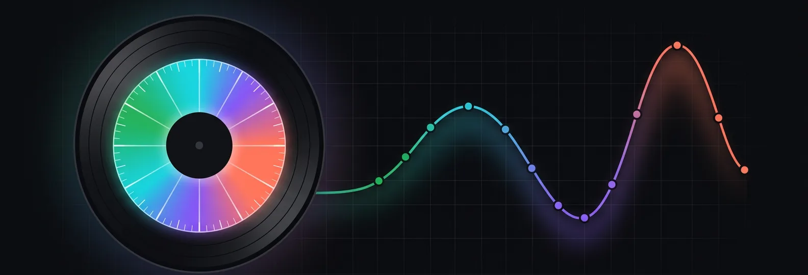
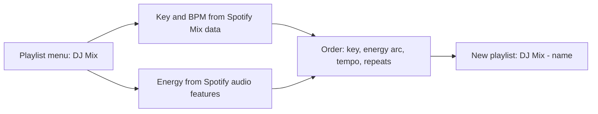
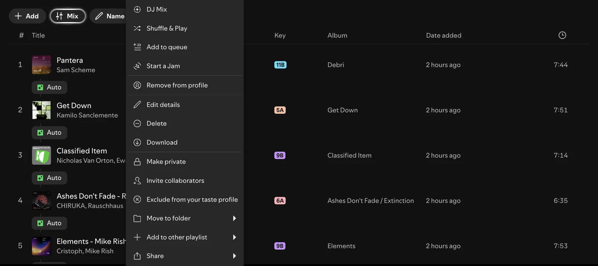
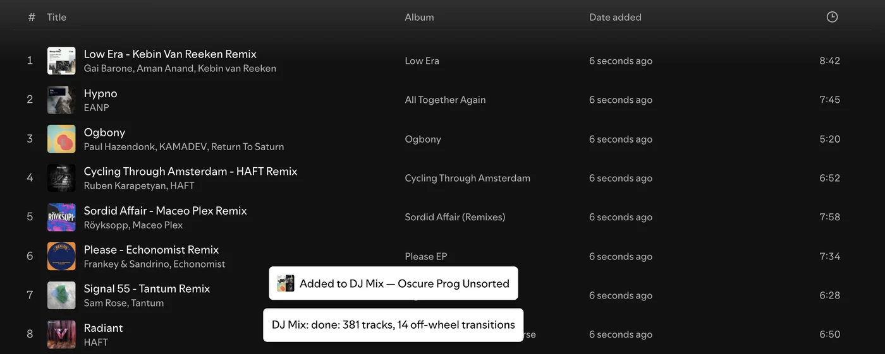
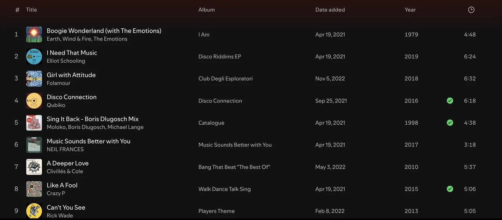

<div align="center">



# DJ Mix

**Turn any Spotify playlist into a DJ set in one click.**

A [Spicetify](https://spicetify.app) extension that reorders a playlist the way a DJ would: compatible keys on the Camelot wheel, an energy arc with two waves, small tempo steps. It uses the same keys and BPM Spotify shows in its own Mix mode, runs locally in seconds and saves the result as a new playlist, so the original never changes. It also adds a **Year** column with each track's release year to every playlist.

<p>
  <a href="LICENSE"></a>
  <a href="https://spicetify.app"></a>
  <a href="tests/"></a>
  
</p>

</div>

## Why

Sorting by key walks once around the wheel. Sorting by BPM gives you a flat line. A DJ set does both at once and tells a story.

| Rule | What DJ Mix does |
|---|---|
| Harmonic mixing | Every transition stays on the Camelot wheel: same key, ±1, relative major/minor, +2 boost, an occasional diagonal |
| Energy arc | Calm opening, a first wave, a dip, a higher second wave, a short cool-down |
| Tempo | Neighbours stay within 2 BPM; tempo is not treated as energy |
| Variety | Two versions of one track never sit side by side; the same artist is not played twice in a row |

## How it works







## Year column

Every playlist gets a **Year** column before the duration: the release year Spotify has for each track. Click the **Year** header to sort your playlist by year (oldest first, click again for newest first). Spotify has no year sort for playlists, so this reorders the playlist itself; added dates stay as they were.



## Install

**Marketplace:** open Spicetify Marketplace in Spotify, search for **DJ Mix**, click Install.

**Manual, macOS and Linux:**

```bash
curl -fsSL https://raw.githubusercontent.com/smixs/dj-mix/main/dj-mix.js -o "$(dirname "$(spicetify -c)")/Extensions/dj-mix.js"
spicetify config extensions dj-mix.js
spicetify apply
```

**Manual, Windows (PowerShell):**

```powershell
iwr https://raw.githubusercontent.com/smixs/dj-mix/main/dj-mix.js -OutFile "$(Split-Path (spicetify -c))\Extensions\dj-mix.js"
spicetify config extensions dj-mix.js
spicetify apply
```

**Uninstall:** remove it in Marketplace, or run `spicetify config extensions dj-mix.js-` and `spicetify apply`, then delete `dj-mix.js` from the Extensions folder.

## Use

Right-click a playlist (or press `⋯`), choose **DJ Mix**. A new playlist **DJ Mix — `name`** opens when it is ready; 381 tracks take about 3 seconds.

## Develop

`bun test` runs the rules tests, `bun build.ts` bundles `src/` into `dj-mix.js`. Marketplace loads extensions through jsDelivr, which caches `@main` for up to 12 hours: after a push run `bun run purge`. Details of the scoring: [docs/how-it-works.md](docs/how-it-works.md).

## Credits

Built on [Spicetify](https://github.com/spicetify/cli). Inspired by [Sort-Play](https://github.com/hoeci/sort-play). MIT. Copyright 2026 Sergey Shima.
